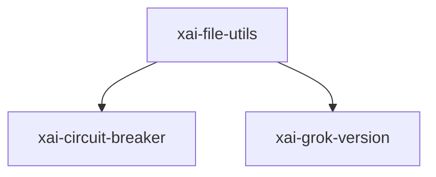

# xai-file-utils — File utilities

## What it is

`xai-file-utils` is a Cargo workspace member at `crates/codegen/xai-file-utils` (15 `.rs` files).

Local data collection: per-turn event tracking, upload queueing, and S3-compatible blob storage.

**Role:** File utilities. [Graph: approximate via crate tree; Human:Synthesis from lib.rs docs]

## How it works

Primary surface is `src/lib.rs`.

Notable workspace dependencies (from crate Cargo.toml, truncated): `anyhow`, `base64.workspace`, `dunce`, `xai-circuit-breaker`, `xai-grok-version`, `aws-sdk-s3`, `aws-config`, `aws-smithy-http-client`.

## Used by

- Parent cluster: [codegen](codegen.md)
- Other crates that depend on this package (see Cargo graph / `cargo tree -p xai-file-utils`)

## Blast radius

Changes affect any consumer of `xai-file-utils` in the workspace. Run `cargo test -p xai-file-utils` and re-check dependent top crates (`xai-grok-shell`, `xai-grok-pager`, `xai-grok-tools`) when public APIs move.

## See also

- [systems/codegen.md](codegen.md)
- [entrypoint](../entrypoints/main.md)
- Workspace root `Cargo.toml` (generated — do not hand-edit)
