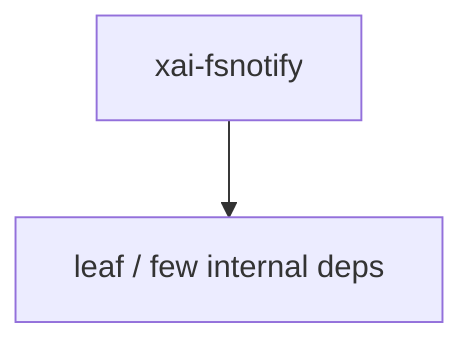

# xai-fsnotify — FS notify

## What it is

`xai-fsnotify` is a Cargo workspace member at `crates/codegen/xai-fsnotify` (10 `.rs` files).

Local-filesystem event source. Single causal stream of wire-ready `FsEvent`s on one broadcast channel. The `xai-grok-workspace` layer translates these into `WorkspaceEvent`s with git-enrichment I/O.  Single workspace root only; multi-root composition (parent + worktrees) lives in the workspace layer.

**Role:** FS notify. [Graph: approximate via crate tree; Human:Synthesis from lib.rs docs]

## How it works

Primary surface is `src/lib.rs`.

Notable workspace dependencies (from crate Cargo.toml, truncated): `dunce`, `notify`, `notify-debouncer-full`, `ignore`, `globset`, `tokio`, `tokio-util`, `tracing`.

## Used by

- Parent cluster: [codegen](codegen.md)
- Other crates that depend on this package (see Cargo graph / `cargo tree -p xai-fsnotify`)

## Blast radius

Changes affect any consumer of `xai-fsnotify` in the workspace. Run `cargo test -p xai-fsnotify` and re-check dependent top crates (`xai-grok-shell`, `xai-grok-pager`, `xai-grok-tools`) when public APIs move.

## See also

- [systems/codegen.md](codegen.md)
- [entrypoint](../entrypoints/main.md)
- Workspace root `Cargo.toml` (generated — do not hand-edit)

## Notes

- Prefer `cargo check -p xai-fsnotify` / `cargo test -p xai-fsnotify` for this crate.
- Full workspace builds are slow; target the crate under change.
- See root README for build prerequisites (Rust toolchain, protoc).
