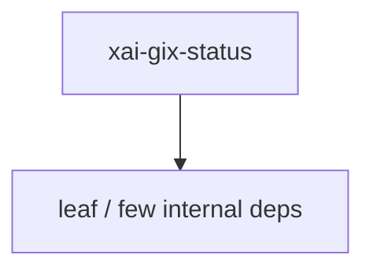

# xai-gix-status — Workspace crate

## What it is

`xai-gix-status` is a Cargo workspace member at `crates/codegen/xai-gix-status` (1 `.rs` files).

Shared helpers for `gix` status scans.  `gix-features` `in_parallel` does `spawn_scoped(...).expect("valid name")`. Under `panic=abort` and a tight `RLIMIT_NPROC`, a failed spawn aborts the whole process instead of becoming a recoverable `JoinError`. Cap `index_worktree_options.thread_limit` so produce workers stay within headroom. `Some(0)` means unlimited in gix — never pass 0.

**Role:** Workspace crate. [Graph: approximate via crate tree; Human:Synthesis from lib.rs docs]

## How it works

Primary surface is `src/lib.rs`.

Notable workspace dependencies (from crate Cargo.toml, truncated): `gix`.

## Used by

- Parent cluster: [codegen](codegen.md)
- Other crates that depend on this package (see Cargo graph / `cargo tree -p xai-gix-status`)

## Blast radius

Changes affect any consumer of `xai-gix-status` in the workspace. Run `cargo test -p xai-gix-status` and re-check dependent top crates (`xai-grok-shell`, `xai-grok-pager`, `xai-grok-tools`) when public APIs move.

## See also

- [systems/codegen.md](codegen.md)
- [entrypoint](../entrypoints/main.md)
- Workspace root `Cargo.toml` (generated — do not hand-edit)

## Notes

- Prefer `cargo check -p xai-gix-status` / `cargo test -p xai-gix-status` for this crate.
- Full workspace builds are slow; target the crate under change.
- See root README for build prerequisites (Rust toolchain, protoc).
