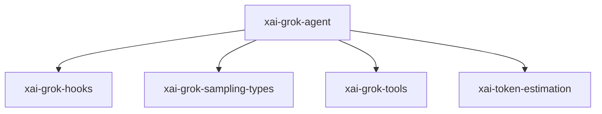

# xai-grok-agent — Agent core helpers

## What it is

`xai-grok-agent` is a Cargo workspace member at `crates/codegen/xai-grok-agent` (30 `.rs` files).

Agent builder, definition parsing, and system prompt assembly.  This crate extracts a first-class `Agent` type from `xai-grok-shell`. An `Agent` bundles tools, system prompt, system-reminder policy, compaction policy, and model configuration into a single, portable object that any host can consume.

**Role:** Agent core helpers. [Graph: approximate via crate tree; Human:Synthesis from lib.rs docs]

## How it works

Primary surface is `src/lib.rs`.

Notable workspace dependencies (from crate Cargo.toml, truncated): `dunce`, `xai-grok-hooks`, `xai-grok-sampling-types`, `xai-grok-tools`, `xai-token-estimation`, `minijinja`, `git2`, `regex`.

## Used by

- Parent cluster: [codegen](codegen.md)
- Other crates that depend on this package (see Cargo graph / `cargo tree -p xai-grok-agent`)

## Blast radius

Changes affect any consumer of `xai-grok-agent` in the workspace. Run `cargo test -p xai-grok-agent` and re-check dependent top crates (`xai-grok-shell`, `xai-grok-pager`, `xai-grok-tools`) when public APIs move.

## See also

- [systems/codegen.md](codegen.md)
- [entrypoint](../entrypoints/main.md)
- Workspace root `Cargo.toml` (generated — do not hand-edit)
