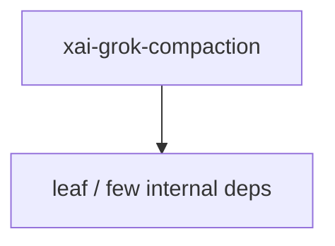

# xai-grok-compaction — Context compaction

## What it is

`xai-grok-compaction` is a Cargo workspace member at `crates/common/xai-grok-compaction` (33 `.rs` files).

Shared, transport-agnostic compaction engine.  This crate is the `compaction-core`: shared policy, prompts, selection, and assembly. Host-specific trigger wiring, transport, persistence / replay / rewind, state commit, metrics backends, and prompt-variant forks stay in each product host (for example `xai-grok-shell`).  The crate depends on **neither** a conversation-type crate nor `xai-grok-sampli

**Role:** Context compaction. [Graph: approximate via crate tree; Human:Synthesis from lib.rs docs]

## How it works

Primary surface is `src/lib.rs`.

Notable workspace dependencies (from crate Cargo.toml, truncated): `anyhow`, `async-trait`, `serde`, `thiserror`, `tokio`, `tracing`.

## Used by

- Parent cluster: [common](common.md)
- Other crates that depend on this package (see Cargo graph / `cargo tree -p xai-grok-compaction`)

## Blast radius

Changes affect any consumer of `xai-grok-compaction` in the workspace. Run `cargo test -p xai-grok-compaction` and re-check dependent top crates (`xai-grok-shell`, `xai-grok-pager`, `xai-grok-tools`) when public APIs move.

## See also

- [systems/common.md](common.md)
- [entrypoint](../entrypoints/main.md)
- Workspace root `Cargo.toml` (generated — do not hand-edit)

## Notes

- Prefer `cargo check -p xai-grok-compaction` / `cargo test -p xai-grok-compaction` for this crate.
- Full workspace builds are slow; target the crate under change.
- See root README for build prerequisites (Rust toolchain, protoc).
