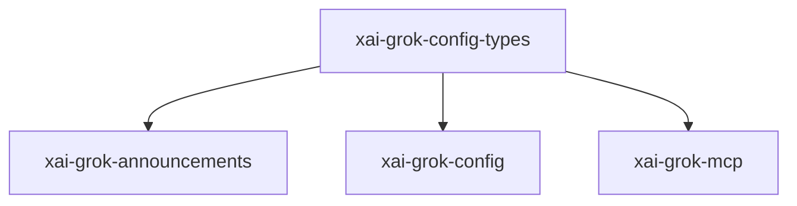

# xai-grok-config-types — Config type defs

## What it is

`xai-grok-config-types` is a Cargo workspace member at `crates/codegen/xai-grok-config-types` (6 `.rs` files).

Rust crate `xai-grok-config-types` at `crates/codegen/xai-grok-config-types`.

**Role:** Config type defs. [Graph: approximate via crate tree; Human:Synthesis from lib.rs docs]

## How it works

Primary surface is `src/lib.rs`.

Notable workspace dependencies (from crate Cargo.toml, truncated): `agent-client-protocol`, `indexmap`, `serde`, `serde_json`, `strum`, `tracing`, `xai-grok-announcements`, `xai-grok-config`.

## Used by

- Parent cluster: [codegen](codegen.md)
- Other crates that depend on this package (see Cargo graph / `cargo tree -p xai-grok-config-types`)

## Blast radius

Changes affect any consumer of `xai-grok-config-types` in the workspace. Run `cargo test -p xai-grok-config-types` and re-check dependent top crates (`xai-grok-shell`, `xai-grok-pager`, `xai-grok-tools`) when public APIs move.

## See also

- [systems/codegen.md](codegen.md)
- [entrypoint](../entrypoints/main.md)
- Workspace root `Cargo.toml` (generated — do not hand-edit)
