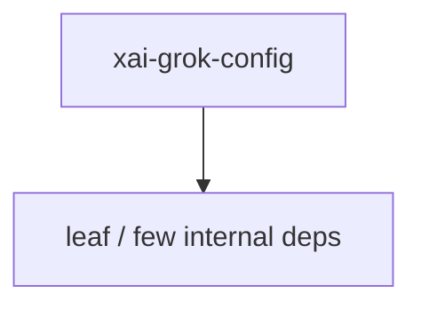

# xai-grok-config — Config loading/merge

## What it is

`xai-grok-config` is a Cargo workspace member at `crates/codegen/xai-grok-config` (14 `.rs` files).

Config file loading for Grok.  Merge order (lowest → highest priority): 1. `/etc/grok/managed_config.toml` 2. `$GROK_HOME/managed_config.toml` 3. `$GROK_HOME/config.toml` 4. `$GROK_HOME/requirements.toml` (cloud cache; Ed25519-signed at rest once a key is embedded — see `signed_policy` — below the OS-protected layers) 5. `/etc/grok/requirements.toml` 6. macOS MDM managed preferences (`ai.x.grok`

**Role:** Config loading/merge. [Graph: approximate via crate tree; Human:Synthesis from lib.rs docs]

## How it works

Primary surface is `src/lib.rs`.

Notable workspace dependencies (from crate Cargo.toml, truncated): `base64`, `blake3`, `dunce`, `prod-mc-cli-chat-proxy-types`, `ring`, `semver`, `serde`, `serde_json`.

## Used by

- Parent cluster: [codegen](codegen.md)
- Other crates that depend on this package (see Cargo graph / `cargo tree -p xai-grok-config`)

## Blast radius

Changes affect any consumer of `xai-grok-config` in the workspace. Run `cargo test -p xai-grok-config` and re-check dependent top crates (`xai-grok-shell`, `xai-grok-pager`, `xai-grok-tools`) when public APIs move.

## See also

- [systems/codegen.md](codegen.md)
- [entrypoint](../entrypoints/main.md)
- Workspace root `Cargo.toml` (generated — do not hand-edit)

## Notes

- Prefer `cargo check -p xai-grok-config` / `cargo test -p xai-grok-config` for this crate.
- Full workspace builds are slow; target the crate under change.
- See root README for build prerequisites (Rust toolchain, protoc).
