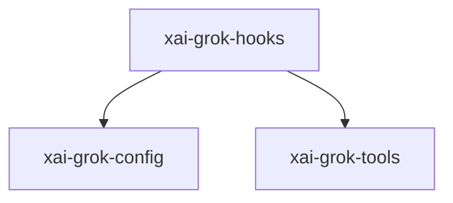

# xai-grok-hooks — Hooks runtime

## What it is

`xai-grok-hooks` is a Cargo workspace member at `crates/codegen/xai-grok-hooks` (15 `.rs` files).

# xai-grok-hooks  Runtime hook system for Grok — file-based discovery, command execution, and policy enforcement.  ## Overview  This crate provides a minimal hooks system for Grok. Hooks are discovered from dedicated directories (`~/.grok/hooks/` and `<git-worktree-root>/.grok/hooks/`), defined in JSON files (compatible settings format), and executed as child processes.  ## v0 scope  - Four event 

**Role:** Hooks runtime. [Graph: approximate via crate tree; Human:Synthesis from lib.rs docs]

## How it works

Primary surface is `src/lib.rs`.

Notable workspace dependencies (from crate Cargo.toml, truncated): `fastrand`, `regex`, `reqwest`, `serde`, `serde_json`, `shellexpand`, `thiserror`, `tokio`.

## Used by

- Parent cluster: [codegen](codegen.md)
- Other crates that depend on this package (see Cargo graph / `cargo tree -p xai-grok-hooks`)

## Blast radius

Changes affect any consumer of `xai-grok-hooks` in the workspace. Run `cargo test -p xai-grok-hooks` and re-check dependent top crates (`xai-grok-shell`, `xai-grok-pager`, `xai-grok-tools`) when public APIs move.

## See also

- [systems/codegen.md](codegen.md)
- [entrypoint](../entrypoints/main.md)
- Workspace root `Cargo.toml` (generated — do not hand-edit)
