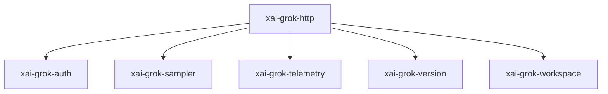

# xai-grok-http — HTTP helpers

## What it is

`xai-grok-http` is a Cargo workspace member at `crates/codegen/xai-grok-http` (1 `.rs` files).

HTTP clients for the application.  Building a `reqwest::Client` is expensive (~95ms) because it loads TLS root certificates from the OS trust store. This module provides four clients for non-sampling traffic (the first three public and cached, the last crate-internal and built on demand):  - `shared_client` -- a `OnceLock`-cached async client for general use (telemetry, feedback, settings, etc.). 

**Role:** HTTP helpers. [Graph: approximate via crate tree; Human:Synthesis from lib.rs docs]

## How it works

Primary surface is `src/lib.rs`.

Notable workspace dependencies (from crate Cargo.toml, truncated): `reqwest`, `reqwest-middleware`, `serde_json`, `tracing`, `xai-grok-auth`, `xai-grok-sampler`, `xai-grok-telemetry`, `xai-grok-version`.

## Used by

- Parent cluster: [codegen](codegen.md)
- Other crates that depend on this package (see Cargo graph / `cargo tree -p xai-grok-http`)

## Blast radius

Changes affect any consumer of `xai-grok-http` in the workspace. Run `cargo test -p xai-grok-http` and re-check dependent top crates (`xai-grok-shell`, `xai-grok-pager`, `xai-grok-tools`) when public APIs move.

## See also

- [systems/codegen.md](codegen.md)
- [entrypoint](../entrypoints/main.md)
- Workspace root `Cargo.toml` (generated — do not hand-edit)
