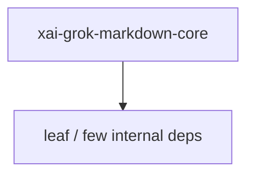

# xai-grok-markdown-core — Workspace crate

## What it is

`xai-grok-markdown-core` is a Cargo workspace member at `crates/codegen/xai-grok-markdown-core` (1 `.rs` files).

Headless markdown analysis sharing Grok Build's exact `pulldown-cmark` config.  This crate is intentionally lean -- it depends only on `pulldown-cmark` -- so it can be used without pulling in the terminal-rendering stack (syntect, ratatui, two-face). `parser_options` is the single source of truth for the parser feature set, shared with `xai-grok-markdown` so analysis matches what Grok Build actu

**Role:** Workspace crate. [Graph: approximate via crate tree; Human:Synthesis from lib.rs docs]

## How it works

Primary surface is `src/lib.rs`.

Notable workspace dependencies (from crate Cargo.toml, truncated): `pulldown-cmark`.

## Used by

- Parent cluster: [codegen](codegen.md)
- Other crates that depend on this package (see Cargo graph / `cargo tree -p xai-grok-markdown-core`)

## Blast radius

Changes affect any consumer of `xai-grok-markdown-core` in the workspace. Run `cargo test -p xai-grok-markdown-core` and re-check dependent top crates (`xai-grok-shell`, `xai-grok-pager`, `xai-grok-tools`) when public APIs move.

## See also

- [systems/codegen.md](codegen.md)
- [entrypoint](../entrypoints/main.md)
- Workspace root `Cargo.toml` (generated — do not hand-edit)

## Notes

- Prefer `cargo check -p xai-grok-markdown-core` / `cargo test -p xai-grok-markdown-core` for this crate.
- Full workspace builds are slow; target the crate under change.
- See root README for build prerequisites (Rust toolchain, protoc).
