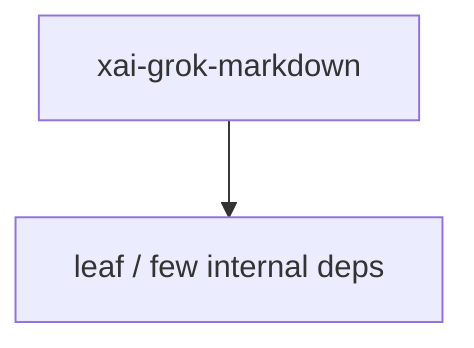

# xai-grok-markdown — Streaming markdown TUI

## What it is

`xai-grok-markdown` is a Cargo workspace member at `crates/codegen/xai-grok-markdown` (28 `.rs` files).

Streaming markdown renderer for terminal UIs.  This crate provides incremental/streaming markdown rendering optimized for displaying LLM responses in terminal UIs. Key features:  - **Streaming rendering**: Efficiently render markdown as it arrives chunk by chunk - **Checkpoint-based freezing**: Only re-render the "tail" after stable boundaries - **Syntax highlighting**: Code blocks highlighted via

**Role:** Streaming markdown TUI. [Graph: approximate via crate tree; Human:Synthesis from lib.rs docs]

## How it works

Primary surface is `src/lib.rs`.

Notable workspace dependencies (from crate Cargo.toml, truncated): `anstyle`, `anstyle-lossy`, `anstyle-syntect`, `html-escape`, `linkify`, `pulldown-cmark`, `ratatui`, `supports-color`.

## Used by

- Parent cluster: [codegen](codegen.md)
- Other crates that depend on this package (see Cargo graph / `cargo tree -p xai-grok-markdown`)

## Blast radius

Changes affect any consumer of `xai-grok-markdown` in the workspace. Run `cargo test -p xai-grok-markdown` and re-check dependent top crates (`xai-grok-shell`, `xai-grok-pager`, `xai-grok-tools`) when public APIs move.

## See also

- [systems/codegen.md](codegen.md)
- [entrypoint](../entrypoints/main.md)
- Workspace root `Cargo.toml` (generated — do not hand-edit)

## Notes

- Prefer `cargo check -p xai-grok-markdown` / `cargo test -p xai-grok-markdown` for this crate.
- Full workspace builds are slow; target the crate under change.
- See root README for build prerequisites (Rust toolchain, protoc).
