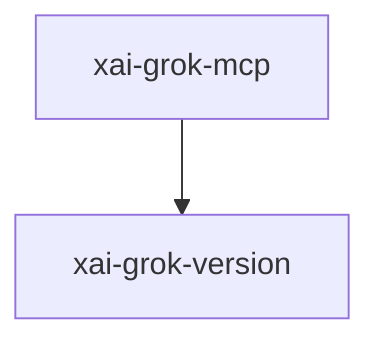

# xai-grok-mcp — MCP integration

## What it is

`xai-grok-mcp` is a Cargo workspace member at `crates/codegen/xai-grok-mcp` (10 `.rs` files).

MCP integration crate.  Two responsibilities:  1. **Quarantines `rmcp` 2.1 and `reqwest` 0.13.** `rmcp` 2.1 requires `reqwest >= 0.13.2`. The rest of the workspace consumes `reqwest` 0.12 and a transitive ecosystem (`opentelemetry-otlp`, `oauth2`, `xai-mixpanel`, `xai-grok-tools`, ...) also pinned to 0.12. Bumping every crate to 0.13 to satisfy `rmcp` triggers a cascade — an OpenTelemetry `HttpCli

**Role:** MCP integration. [Graph: approximate via crate tree; Human:Synthesis from lib.rs docs]

## How it works

Primary surface is `src/lib.rs`.

Notable workspace dependencies (from crate Cargo.toml, truncated): `rmcp`, `xai-grok-version`, `reqwest`, `async-trait`, `axum`, `oauth2`, `parking_lot`, `serde`.

## Used by

- Parent cluster: [codegen](codegen.md)
- Other crates that depend on this package (see Cargo graph / `cargo tree -p xai-grok-mcp`)

## Blast radius

Changes affect any consumer of `xai-grok-mcp` in the workspace. Run `cargo test -p xai-grok-mcp` and re-check dependent top crates (`xai-grok-shell`, `xai-grok-pager`, `xai-grok-tools`) when public APIs move.

## See also

- [systems/codegen.md](codegen.md)
- [entrypoint](../entrypoints/main.md)
- Workspace root `Cargo.toml` (generated — do not hand-edit)

## Notes

- Prefer `cargo check -p xai-grok-mcp` / `cargo test -p xai-grok-mcp` for this crate.
- Full workspace builds are slow; target the crate under change.
- See root README for build prerequisites (Rust toolchain, protoc).
