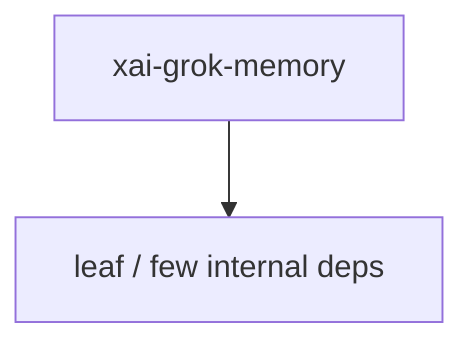

# xai-grok-memory — Cross-session memory

## What it is

`xai-grok-memory` is a Cargo workspace member at `crates/codegen/xai-grok-memory` (15 `.rs` files).

Memory system for cross-session knowledge persistence.  This crate provides a markdown-based memory storage layer that allows Grok to persist important information across sessions. Memory files are stored under `~/.grok/memory/` with workspace-scoped subdirectories keyed by a blake3 hash of the workspace path.  ## Data Layout  ```text ~/.grok/memory/ ├── MEMORY.md                         # Global 

**Role:** Cross-session memory. [Graph: approximate via crate tree; Human:Synthesis from lib.rs docs]

## How it works

Primary surface is `src/lib.rs`.

Notable workspace dependencies (from crate Cargo.toml, truncated): `anyhow`, `arc-swap`, `async-trait`, `blake3`, `chrono`, `dunce`, `flate2`, `git2`.



## Used by

- Parent cluster: [codegen](codegen.md)
- Other crates that depend on this package (see Cargo graph / `cargo tree -p xai-grok-memory`)

## Blast radius

Changes affect any consumer of `xai-grok-memory` in the workspace. Run `cargo test -p xai-grok-memory` and re-check dependent top crates (`xai-grok-shell`, `xai-grok-pager`, `xai-grok-tools`) when public APIs move.

## See also

- [systems/codegen.md](codegen.md)
- [entrypoint](../entrypoints/main.md)
- Workspace root `Cargo.toml` (generated — do not hand-edit)

## Notes

- Prefer `cargo check -p xai-grok-memory` / `cargo test -p xai-grok-memory` for this crate.
- Full workspace builds are slow; target the crate under change.
- See root README for build prerequisites (Rust toolchain, protoc).
