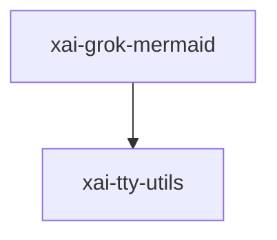

# xai-grok-mermaid — Mermaid integration

## What it is

`xai-grok-mermaid` is a Cargo workspace member at `crates/codegen/xai-grok-mermaid` (7 `.rs` files).

Render [Mermaid](https://mermaid.js.org/) diagram source to a rasterized PNG, behind a swappable `MermaidEngine` trait.  This crate is a self-contained, pure-library building block: it turns Mermaid diagram text into PNG bytes with no Node, no headless browser, and no network. It isolates the layout engine and the SVG raster stack behind our own audited boundary so the rest of the CLI can swap e

**Role:** Mermaid integration. [Graph: approximate via crate tree; Human:Synthesis from lib.rs docs]

## How it works

Primary surface is `src/lib.rs`.

Notable workspace dependencies (from crate Cargo.toml, truncated): `resvg`, `tiny-skia`, `fontdb`, `thiserror`, `tracing`, `which`, `xai-tty-utils`, `wait-timeout`.

## Used by

- Parent cluster: [codegen](codegen.md)
- Other crates that depend on this package (see Cargo graph / `cargo tree -p xai-grok-mermaid`)

## Blast radius

Changes affect any consumer of `xai-grok-mermaid` in the workspace. Run `cargo test -p xai-grok-mermaid` and re-check dependent top crates (`xai-grok-shell`, `xai-grok-pager`, `xai-grok-tools`) when public APIs move.

## See also

- [systems/codegen.md](codegen.md)
- [entrypoint](../entrypoints/main.md)
- Workspace root `Cargo.toml` (generated — do not hand-edit)

## Notes

- Prefer `cargo check -p xai-grok-mermaid` / `cargo test -p xai-grok-mermaid` for this crate.
- Full workspace builds are slow; target the crate under change.
- See root README for build prerequisites (Rust toolchain, protoc).
