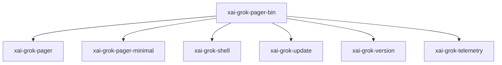

# xai-grok-pager-bin — Entrypoint composition root

## What it is

`xai-grok-pager-bin` is a Cargo workspace member at `crates/codegen/xai-grok-pager-bin` (2 `.rs` files).

Rust crate `xai-grok-pager-bin` at `crates/codegen/xai-grok-pager-bin`.

**Role:** Entrypoint composition root. [Graph: approximate via crate tree; Human:Synthesis from lib.rs docs]

## How it works

Primary surface is `src/lib.rs` and `src/main.rs`.

Notable workspace dependencies (from crate Cargo.toml, truncated): `xai-grok-pager`, `xai-grok-pager-minimal`, `xai-grok-shell`, `xai-grok-update`, `xai-grok-version`, `xai-grok-telemetry`, `xai-grok-workspace`, `xai-crash-handler`.

## Used by

- Parent cluster: [codegen](codegen.md)
- Other crates that depend on this package (see Cargo graph / `cargo tree -p xai-grok-pager-bin`)

## Blast radius

Changes affect any consumer of `xai-grok-pager-bin` in the workspace. Run `cargo test -p xai-grok-pager-bin` and re-check dependent top crates (`xai-grok-shell`, `xai-grok-pager`, `xai-grok-tools`) when public APIs move.

## See also

- [systems/codegen.md](codegen.md)
- [entrypoint](../entrypoints/main.md)
- Workspace root `Cargo.toml` (generated — do not hand-edit)
