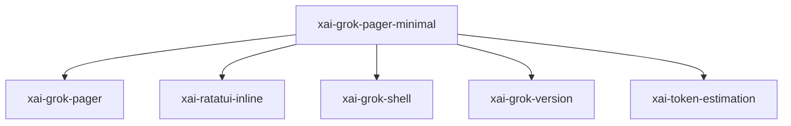

# xai-grok-pager-minimal — Minimal scrollback-native mode

## What it is

`xai-grok-pager-minimal` is a Cargo workspace member at `crates/codegen/xai-grok-pager-minimal` (11 `.rs` files).

Minimal (scrollback-native) render mode — `grok --minimal`.  In this mode finalized conversation blocks are printed once into the terminal's *native* scrollback (via `xai_ratatui_inline::Terminal::insert_before`, reusing `EntryRenderer`) while a small pinned live region holds the running-turn status, the prompt, and a minimal status line. The interactive `ScrollbackPane` (scroll, fold, selection, 

**Role:** Minimal scrollback-native mode. [Graph: approximate via crate tree; Human:Synthesis from lib.rs docs]

## How it works

Primary surface is `src/lib.rs`.

Notable workspace dependencies (from crate Cargo.toml, truncated): `xai-grok-pager`, `ratatui`, `crossterm`, `uuid`, `tracing`, `xai-ratatui-inline`, `chrono`, `similar`.

## Used by

- Parent cluster: [codegen](codegen.md)
- Other crates that depend on this package (see Cargo graph / `cargo tree -p xai-grok-pager-minimal`)

## Blast radius

Changes affect any consumer of `xai-grok-pager-minimal` in the workspace. Run `cargo test -p xai-grok-pager-minimal` and re-check dependent top crates (`xai-grok-shell`, `xai-grok-pager`, `xai-grok-tools`) when public APIs move.

## See also

- [systems/codegen.md](codegen.md)
- [entrypoint](../entrypoints/main.md)
- Workspace root `Cargo.toml` (generated — do not hand-edit)
