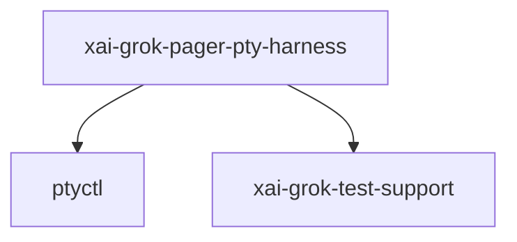

# xai-grok-pager-pty-harness — PTY harness / benches

## What it is

`xai-grok-pager-pty-harness` is a Cargo workspace member at `crates/codegen/xai-grok-pager-pty-harness` (37 `.rs` files).

Unified PTY harness for xai-grok-pager.  The same layered API serves three consumers:  1. **Regression scenarios** (e.g. `scenarios::plan_approval_resume`, exercised via `tests/` in this crate and `pty-scenario` YAML under `xai-grok-pager/tests/scenarios/`) — assert screen contents and multi-process resume behavior. 2. **Benchmarks** (`benches/pty_bench.rs`) — run timing scenarios, collect per-fra

**Role:** PTY harness / benches. [Graph: approximate via crate tree; Human:Synthesis from lib.rs docs]

## How it works

Primary surface is `src/lib.rs`.

Notable workspace dependencies (from crate Cargo.toml, truncated): `dunce`, `ptyctl`, `portable-pty`, `libc`, `alacritty_terminal`, `xai-grok-test-support`, `tokio`, `anyhow`.

## Used by

- Parent cluster: [codegen](codegen.md)
- Other crates that depend on this package (see Cargo graph / `cargo tree -p xai-grok-pager-pty-harness`)

## Blast radius

Changes affect any consumer of `xai-grok-pager-pty-harness` in the workspace. Run `cargo test -p xai-grok-pager-pty-harness` and re-check dependent top crates (`xai-grok-shell`, `xai-grok-pager`, `xai-grok-tools`) when public APIs move.

## See also

- [systems/codegen.md](codegen.md)
- [entrypoint](../entrypoints/main.md)
- Workspace root `Cargo.toml` (generated — do not hand-edit)
