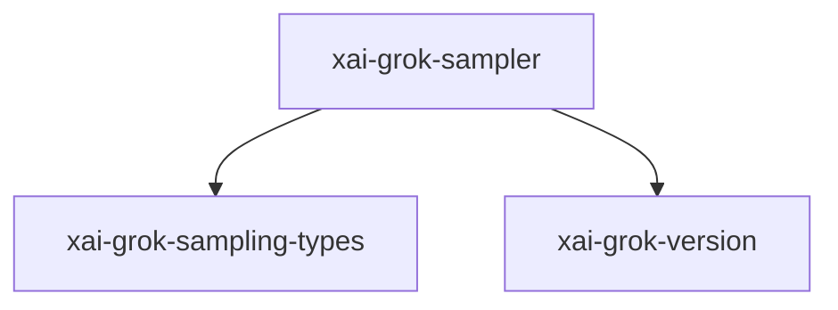

# xai-grok-sampler — Model sampling/streaming

## What it is

`xai-grok-sampler` is a Cargo workspace member at `crates/codegen/xai-grok-sampler` (26 `.rs` files).

xai-grok-sampler - Actor-based sampling layer for xAI grok.  This crate extracts the HTTP streaming + retry logic out of `xai-grok-shell`'s session actor into a standalone, reusable component built on the same actor pattern as `xai-hunk-tracker`.  ## Layered API  - **Layer 1**: `client::SamplingClient` returns raw chunk streams. - **Layer 2**: `stream` transforms raw streams into [`SamplingEve

**Role:** Model sampling/streaming. [Graph: approximate via crate tree; Human:Synthesis from lib.rs docs]

## How it works

Primary surface is `src/lib.rs`.

Notable workspace dependencies (from crate Cargo.toml, truncated): `xai-grok-sampling-types`, `xai-grok-version`, `async-openai`, `async-stream`, `chrono`, `eventsource-stream`, `futures-util`, `indexmap`.

## Used by

- Parent cluster: [codegen](codegen.md)
- Other crates that depend on this package (see Cargo graph / `cargo tree -p xai-grok-sampler`)

## Blast radius

Changes affect any consumer of `xai-grok-sampler` in the workspace. Run `cargo test -p xai-grok-sampler` and re-check dependent top crates (`xai-grok-shell`, `xai-grok-pager`, `xai-grok-tools`) when public APIs move.

## See also

- [systems/codegen.md](codegen.md)
- [entrypoint](../entrypoints/main.md)
- Workspace root `Cargo.toml` (generated — do not hand-edit)
