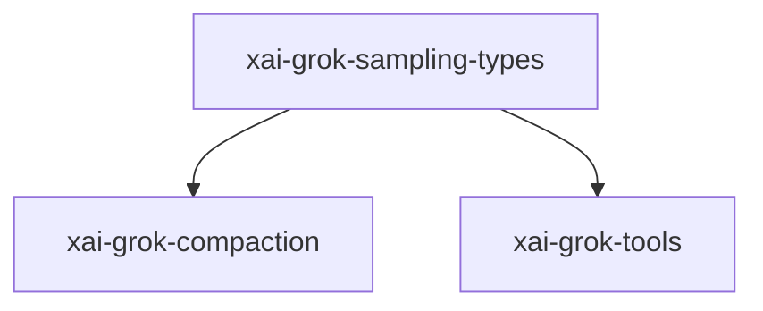

# xai-grok-sampling-types — Sampling shared types

## What it is

`xai-grok-sampling-types` is a Cargo workspace member at `crates/codegen/xai-grok-sampling-types` (7 `.rs` files).

Pure data types for the xAI sampling / chat-completion API layer.  This crate contains the API-agnostic conversation types, chat completion request/response types, streaming types, and error types used across the xAI agent stack.  It intentionally contains **no I/O** (no HTTP clients, no file system access) so it can be depended on by downstream crates (e.g., `xai-chat-state`) without pulling in t

**Role:** Sampling shared types. [Graph: approximate via crate tree; Human:Synthesis from lib.rs docs]

## How it works

Primary surface is `src/lib.rs`.

Notable workspace dependencies (from crate Cargo.toml, truncated): `async-openai`, `indexmap`, `reqwest`, `serde`, `serde_json`, `thiserror`, `tracing`, `xai-grok-compaction`.

## Used by

- Parent cluster: [codegen](codegen.md)
- Other crates that depend on this package (see Cargo graph / `cargo tree -p xai-grok-sampling-types`)

## Blast radius

Changes affect any consumer of `xai-grok-sampling-types` in the workspace. Run `cargo test -p xai-grok-sampling-types` and re-check dependent top crates (`xai-grok-shell`, `xai-grok-pager`, `xai-grok-tools`) when public APIs move.

## See also

- [systems/codegen.md](codegen.md)
- [entrypoint](../entrypoints/main.md)
- Workspace root `Cargo.toml` (generated — do not hand-edit)
