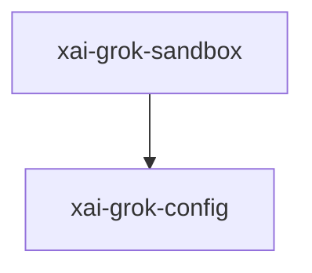

# xai-grok-sandbox — OS sandbox

## What it is

`xai-grok-sandbox` is a Cargo workspace member at `crates/codegen/xai-grok-sandbox` (11 `.rs` files).

OS-level sandboxing for Grok Build via [nono](https://crates.io/crates/nono).  Applied once at process startup. Covers in-process `tokio::fs` calls and child processes. Network is left open at the process level (agent needs LLM API); child network is blocked per-subprocess via seccomp.  The `enforce` feature (on by default) pulls in `nono` for kernel-enforced sandboxing (Landlock/Seatbelt). When d

**Role:** OS sandbox. [Graph: approximate via crate tree; Human:Synthesis from lib.rs docs]

## How it works

Primary surface is `src/lib.rs`.

Notable workspace dependencies (from crate Cargo.toml, truncated): `anyhow`, `chrono`, `dirs`, `dunce`, `serde`, `serde_json`, `toml`, `tracing`.

## Used by

- Parent cluster: [codegen](codegen.md)
- Other crates that depend on this package (see Cargo graph / `cargo tree -p xai-grok-sandbox`)

## Blast radius

Changes affect any consumer of `xai-grok-sandbox` in the workspace. Run `cargo test -p xai-grok-sandbox` and re-check dependent top crates (`xai-grok-shell`, `xai-grok-pager`, `xai-grok-tools`) when public APIs move.

## See also

- [systems/codegen.md](codegen.md)
- [entrypoint](../entrypoints/main.md)
- Workspace root `Cargo.toml` (generated — do not hand-edit)

## Notes

- Prefer `cargo check -p xai-grok-sandbox` / `cargo test -p xai-grok-sandbox` for this crate.
- Full workspace builds are slow; target the crate under change.
- See root README for build prerequisites (Rust toolchain, protoc).
