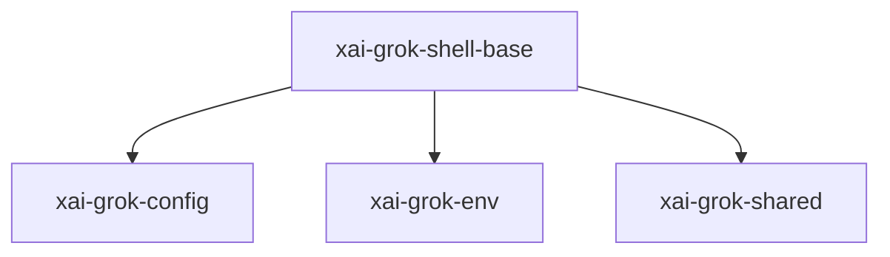

# xai-grok-shell-base — Shell base helpers

## What it is

`xai-grok-shell-base` is a Cargo workspace member at `crates/codegen/xai-grok-shell-base` (10 `.rs` files).

Foundation modules shared by the grok shell crate family. Extracted from `xai-grok-shell` (which re-exports them at their original paths) so they build in parallel and stop rebuilding on shell edits.

**Role:** Shell base helpers. [Graph: approximate via crate tree; Human:Synthesis from lib.rs docs]

## How it works

Primary surface is `src/lib.rs`.

Notable workspace dependencies (from crate Cargo.toml, truncated): `anyhow`, `chrono`, `reqwest`, `serde`, `serde_json`, `thiserror`, `tokio`, `tracing`.

## Used by

- Parent cluster: [codegen](codegen.md)
- Other crates that depend on this package (see Cargo graph / `cargo tree -p xai-grok-shell-base`)

## Blast radius

Changes affect any consumer of `xai-grok-shell-base` in the workspace. Run `cargo test -p xai-grok-shell-base` and re-check dependent top crates (`xai-grok-shell`, `xai-grok-pager`, `xai-grok-tools`) when public APIs move.

## See also

- [systems/codegen.md](codegen.md)
- [entrypoint](../entrypoints/main.md)
- Workspace root `Cargo.toml` (generated — do not hand-edit)
