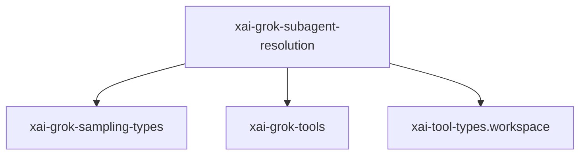

# xai-grok-subagent-resolution — Workspace crate

## What it is

`xai-grok-subagent-resolution` is a Cargo workspace member at `crates/codegen/xai-grok-subagent-resolution` (6 `.rs` files).

Subagent configuration resolution crate.  Extracts the pure-logic "resolution" phase of subagent spawning from `xai-grok-shell` into a reusable library. Given a spawn request and a resolution context (roles, personas, parent state), this crate resolves:  - Effective runtime config (model, persona, capability mode, isolation) via precedence: explicit override > role > persona > parent. - Persona in

**Role:** Workspace crate. [Graph: approximate via crate tree; Human:Synthesis from lib.rs docs]

## How it works

Primary surface is `src/lib.rs`.

Notable workspace dependencies (from crate Cargo.toml, truncated): `serde`, `serde_json`, `thiserror`, `tracing`, `xai-grok-sampling-types`, `xai-grok-tools`, `xai-tool-types.workspace`.

## Used by

- Parent cluster: [codegen](codegen.md)
- Other crates that depend on this package (see Cargo graph / `cargo tree -p xai-grok-subagent-resolution`)

## Blast radius

Changes affect any consumer of `xai-grok-subagent-resolution` in the workspace. Run `cargo test -p xai-grok-subagent-resolution` and re-check dependent top crates (`xai-grok-shell`, `xai-grok-pager`, `xai-grok-tools`) when public APIs move.

## See also

- [systems/codegen.md](codegen.md)
- [entrypoint](../entrypoints/main.md)
- Workspace root `Cargo.toml` (generated — do not hand-edit)
