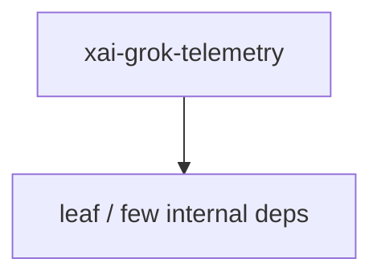

# xai-grok-telemetry — Telemetry engine

## What it is

`xai-grok-telemetry` is a Cargo workspace member at `crates/codegen/xai-grok-telemetry` (39 `.rs` files).

Telemetry engine for Grok Build sessions: product events + Mixpanel emission + Sentry error reporting + OpenTelemetry tracing + structured unified log.  Extracted from `xai-file-utils` per review feedback so telemetry has its own ownership boundary (see CODEOWNERS) and so downstream consumers that only want event tracking + inference metrics no longer pull in Mixpanel/HTTP/identity dependencies.

**Role:** Telemetry engine. [Graph: approximate via crate tree; Human:Synthesis from lib.rs docs]

## How it works

Primary surface is `src/lib.rs`.

Notable workspace dependencies (from crate Cargo.toml, truncated): `anyhow`, `serde`, `serde_json`, `strum`, `tracing`, `tracing-appender`, `tracing-chrome`, `tracing-subscriber`.

## Used by

- Parent cluster: [codegen](codegen.md)
- Other crates that depend on this package (see Cargo graph / `cargo tree -p xai-grok-telemetry`)

## Blast radius

Changes affect any consumer of `xai-grok-telemetry` in the workspace. Run `cargo test -p xai-grok-telemetry` and re-check dependent top crates (`xai-grok-shell`, `xai-grok-pager`, `xai-grok-tools`) when public APIs move.

## See also

- [systems/codegen.md](codegen.md)
- [entrypoint](../entrypoints/main.md)
- Workspace root `Cargo.toml` (generated — do not hand-edit)

## Notes

- Prefer `cargo check -p xai-grok-telemetry` / `cargo test -p xai-grok-telemetry` for this crate.
- Full workspace builds are slow; target the crate under change.
- See root README for build prerequisites (Rust toolchain, protoc).
