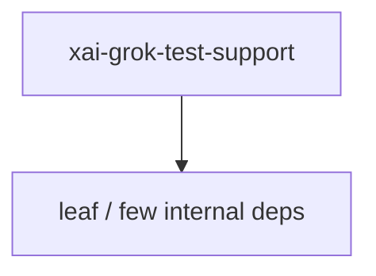

# xai-grok-test-support — Workspace crate

## What it is

`xai-grok-test-support` is a Cargo workspace member at `crates/codegen/xai-grok-test-support` (11 `.rs` files).

Shared test utilities for grok-build crates: mock inference server, SSE generators, ACP stdio client, headless runner, env sandbox.  Provides: - `MockInferenceServer` — Mock /v1/chat/completions + /v1/responses with request logging - `GrokStdioClient` — ACP client that drives `grok agent stdio` as a subprocess - `RawStdioClient` — raw-wire ACP driver for bytes the typed client can't produce 

**Role:** Workspace crate. [Graph: approximate via crate tree; Human:Synthesis from lib.rs docs]

## How it works

Primary surface is `src/lib.rs`.

Notable workspace dependencies (from crate Cargo.toml, truncated): `agent-client-protocol`, `anyhow`, `async-trait`, `axum`, `clap`, `futures-util`, `serde`, `serde_json`.

## Used by

- Parent cluster: [codegen](codegen.md)
- Other crates that depend on this package (see Cargo graph / `cargo tree -p xai-grok-test-support`)

## Blast radius

Changes affect any consumer of `xai-grok-test-support` in the workspace. Run `cargo test -p xai-grok-test-support` and re-check dependent top crates (`xai-grok-shell`, `xai-grok-pager`, `xai-grok-tools`) when public APIs move.

## See also

- [systems/codegen.md](codegen.md)
- [entrypoint](../entrypoints/main.md)
- Workspace root `Cargo.toml` (generated — do not hand-edit)

## Notes

- Prefer `cargo check -p xai-grok-test-support` / `cargo test -p xai-grok-test-support` for this crate.
- Full workspace builds are slow; target the crate under change.
- See root README for build prerequisites (Rust toolchain, protoc).
