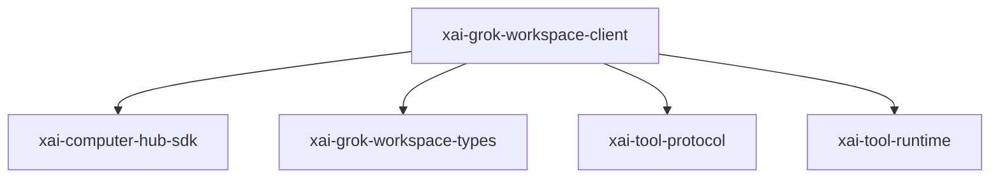

# xai-grok-workspace-client — Workspace client

## What it is

`xai-grok-workspace-client` is a Cargo workspace member at `crates/codegen/xai-grok-workspace-client` (1 `.rs` files).

Typed client for hub-proxied `workspace.*` RPC methods — the single transport for the `workspace_rpc` channel, shared by `WorkspaceOps` proxy mode and by consumers that cannot depend on `xai-grok-workspace`. Wire types live in `xai_grok_workspace_types::rpc`; this crate adds the connected-state latch, the generic `WorkspaceClient::rpc` core, and error mapping.  No deadline is imposed by default 

**Role:** Workspace client. [Graph: approximate via crate tree; Human:Synthesis from lib.rs docs]

## How it works

Primary surface is `src/lib.rs`.

Notable workspace dependencies (from crate Cargo.toml, truncated): `serde`, `serde_json`, `thiserror`, `tokio`, `tracing`, `xai-computer-hub-sdk`, `xai-grok-workspace-types`, `xai-tool-protocol`.

## Used by

- Parent cluster: [codegen](codegen.md)
- Other crates that depend on this package (see Cargo graph / `cargo tree -p xai-grok-workspace-client`)

## Blast radius

Changes affect any consumer of `xai-grok-workspace-client` in the workspace. Run `cargo test -p xai-grok-workspace-client` and re-check dependent top crates (`xai-grok-shell`, `xai-grok-pager`, `xai-grok-tools`) when public APIs move.

## See also

- [systems/codegen.md](codegen.md)
- [entrypoint](../entrypoints/main.md)
- Workspace root `Cargo.toml` (generated — do not hand-edit)
