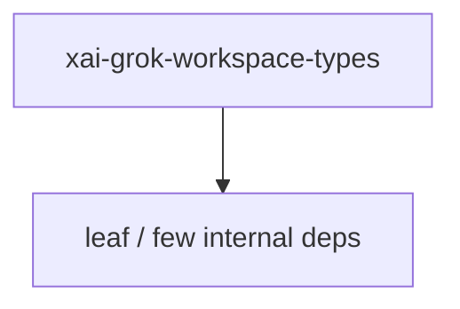

# xai-grok-workspace-types — Workspace request types

## What it is

`xai-grok-workspace-types` is a Cargo workspace member at `crates/codegen/xai-grok-workspace-types` (45 `.rs` files).

Wire types for the `xai-grok-workspace` API.  This crate is intentionally pure-data and depends on nothing more than `base64`, `serde`, `serde_json`, `thiserror`, and `chrono`. There is no tokio, no async-trait, no I/O. This makes it cheap to depend on from anywhere -- including the eventual WASM browser SDK.  # Module overview  - `identity` -- session/tool/hunk identifiers. - `metadata` -- ty

**Role:** Workspace request types. [Graph: approximate via crate tree; Human:Synthesis from lib.rs docs]

## How it works

Primary surface is `src/lib.rs`.

Notable workspace dependencies (from crate Cargo.toml, truncated): `base64`, `chrono`, `serde`, `serde_json`, `thiserror`.

## Used by

- Parent cluster: [codegen](codegen.md)
- Other crates that depend on this package (see Cargo graph / `cargo tree -p xai-grok-workspace-types`)

## Blast radius

Changes affect any consumer of `xai-grok-workspace-types` in the workspace. Run `cargo test -p xai-grok-workspace-types` and re-check dependent top crates (`xai-grok-shell`, `xai-grok-pager`, `xai-grok-tools`) when public APIs move.

## See also

- [systems/codegen.md](codegen.md)
- [entrypoint](../entrypoints/main.md)
- Workspace root `Cargo.toml` (generated — do not hand-edit)

## Notes

- Prefer `cargo check -p xai-grok-workspace-types` / `cargo test -p xai-grok-workspace-types` for this crate.
- Full workspace builds are slow; target the crate under change.
- See root README for build prerequisites (Rust toolchain, protoc).
