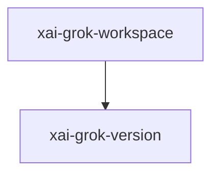

# xai-grok-workspace — Host FS/VCS/permissions

## What it is

`xai-grok-workspace` is a Cargo workspace member at `crates/codegen/xai-grok-workspace` (87 `.rs` files).

Core workspace library: FS, VCS, permissions, tool config, and subsystem wiring.

**Role:** Host FS/VCS/permissions. [Graph: approximate via crate tree; Human:Synthesis from lib.rs docs]

## How it works

Primary surface is `src/lib.rs`.

Notable workspace dependencies (from crate Cargo.toml, truncated): `anyhow`, `arc-swap`, `axum`, `dunce`, `xai-grok-version`, `async-stream`, `async-trait`, `futures`.

## Used by

- Parent cluster: [codegen](codegen.md)
- Other crates that depend on this package (see Cargo graph / `cargo tree -p xai-grok-workspace`)

## Blast radius

Changes affect any consumer of `xai-grok-workspace` in the workspace. Run `cargo test -p xai-grok-workspace` and re-check dependent top crates (`xai-grok-shell`, `xai-grok-pager`, `xai-grok-tools`) when public APIs move.

## See also

- [systems/codegen.md](codegen.md)
- [entrypoint](../entrypoints/main.md)
- Workspace root `Cargo.toml` (generated — do not hand-edit)

## Notes

- Prefer `cargo check -p xai-grok-workspace` / `cargo test -p xai-grok-workspace` for this crate.
- Full workspace builds are slow; target the crate under change.
- See root README for build prerequisites (Rust toolchain, protoc).
