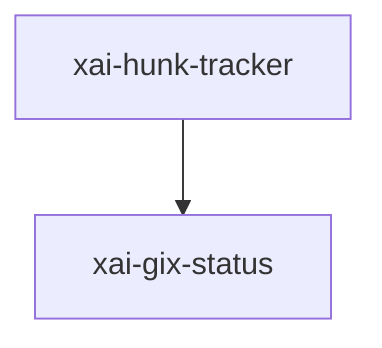

# xai-hunk-tracker — Hunk tracker actor

## What it is

`xai-hunk-tracker` is a Cargo workspace member at `crates/codegen/xai-hunk-tracker` (17 `.rs` files).

xai-hunk-tracker - Track file hunks (diffs) with agent/external attribution.  This crate provides: - Actor-based hunk tracking with source attribution (Agent vs External) - Integration with grok-shell sessions  ## Actor Pattern  The HunkTracker uses an actor pattern with message-passing via channels:  ```text ┌────────────────┐                  ┌──────────────────────────────────────┐ │  Agent Too

**Role:** Hunk tracker actor. [Graph: approximate via crate tree; Human:Synthesis from lib.rs docs]

## How it works

Primary surface is `src/lib.rs`.

Notable workspace dependencies (from crate Cargo.toml, truncated): `chrono`, `dunce`, `rustc-hash`, `gix`, `serde`, `xai-gix-status`, `serde_json`, `similar`.



## Used by

- Parent cluster: [codegen](codegen.md)
- Other crates that depend on this package (see Cargo graph / `cargo tree -p xai-hunk-tracker`)

## Blast radius

Changes affect any consumer of `xai-hunk-tracker` in the workspace. Run `cargo test -p xai-hunk-tracker` and re-check dependent top crates (`xai-grok-shell`, `xai-grok-pager`, `xai-grok-tools`) when public APIs move.

## See also

- [systems/codegen.md](codegen.md)
- [entrypoint](../entrypoints/main.md)
- Workspace root `Cargo.toml` (generated — do not hand-edit)

## Notes

- Prefer `cargo check -p xai-hunk-tracker` / `cargo test -p xai-hunk-tracker` for this crate.
- Full workspace builds are slow; target the crate under change.
- See root README for build prerequisites (Rust toolchain, protoc).
