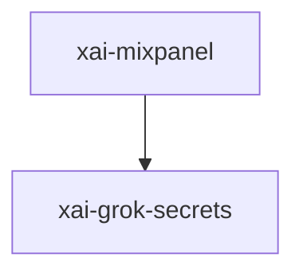

# xai-mixpanel — Workspace crate

## What it is

`xai-mixpanel` is a Cargo workspace member at `crates/codegen/xai-mixpanel` (1 `.rs` files).

Lightweight Mixpanel HTTP tracking client.  This is a minimal replacement for `mixpanel-rs` that uses `reqwest 0.12` instead of `reqwest 0.11`, avoiding a duplicate HTTP stack in the binary.  Only the `track` API is implemented since that's all we use.

**Role:** Workspace crate. [Graph: approximate via crate tree; Human:Synthesis from lib.rs docs]

## How it works

Primary surface is `src/lib.rs`.

Notable workspace dependencies (from crate Cargo.toml, truncated): `reqwest`, `serde_json`, `base64`, `thiserror`, `xai-grok-secrets`.

## Used by

- Parent cluster: [codegen](codegen.md)
- Other crates that depend on this package (see Cargo graph / `cargo tree -p xai-mixpanel`)

## Blast radius

Changes affect any consumer of `xai-mixpanel` in the workspace. Run `cargo test -p xai-mixpanel` and re-check dependent top crates (`xai-grok-shell`, `xai-grok-pager`, `xai-grok-tools`) when public APIs move.

## See also

- [systems/codegen.md](codegen.md)
- [entrypoint](../entrypoints/main.md)
- Workspace root `Cargo.toml` (generated — do not hand-edit)

## Notes

- Prefer `cargo check -p xai-mixpanel` / `cargo test -p xai-mixpanel` for this crate.
- Full workspace builds are slow; target the crate under change.
- See root README for build prerequisites (Rust toolchain, protoc).
