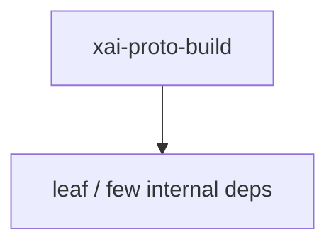

# xai-proto-build — Protoc finder

## What it is

`xai-proto-build` is a Cargo workspace member at `crates/build/xai-proto-build` (2 `.rs` files).

Rust crate `xai-proto-build` at `crates/build/xai-proto-build`.

**Role:** Protoc finder. [Graph: approximate via crate tree; Human:Synthesis from lib.rs docs]

## How it works

Primary surface is `src/lib.rs`.

Notable workspace dependencies (from crate Cargo.toml, truncated): `anyhow`, `pbjson-build`, `prost-build`, `tempfile`, `tonic-prost-build`.

## Used by

- Parent cluster: [build](build.md)
- Other crates that depend on this package (see Cargo graph / `cargo tree -p xai-proto-build`)

## Blast radius

Changes affect any consumer of `xai-proto-build` in the workspace. Run `cargo test -p xai-proto-build` and re-check dependent top crates (`xai-grok-shell`, `xai-grok-pager`, `xai-grok-tools`) when public APIs move.

## See also

- [systems/build.md](build.md)
- [entrypoint](../entrypoints/main.md)
- Workspace root `Cargo.toml` (generated — do not hand-edit)

## Notes

- Prefer `cargo check -p xai-proto-build` / `cargo test -p xai-proto-build` for this crate.
- Full workspace builds are slow; target the crate under change.
- See root README for build prerequisites (Rust toolchain, protoc).
