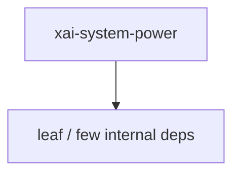

# xai-system-power — Workspace crate

## What it is

`xai-system-power` is a Cargo workspace member at `crates/codegen/xai-system-power` (4 `.rs` files).

Cross-platform system **sleep/wake** (suspend/resume) notifications.  The motivating use case: an OIDC token refresh that is *in flight when the laptop sleeps* can lose its rotated successor token (the server processes the request, rotates/revokes the old refresh token, and the response is lost across the suspend). On wake the client is holding a dead refresh token and the user is forced to re-log

**Role:** Workspace crate. [Graph: approximate via crate tree; Human:Synthesis from lib.rs docs]

## How it works

Primary surface is `src/lib.rs`.

Notable workspace dependencies (from crate Cargo.toml, truncated): (few/none listed).

## Used by

- Parent cluster: [codegen](codegen.md)
- Other crates that depend on this package (see Cargo graph / `cargo tree -p xai-system-power`)

## Blast radius

Changes affect any consumer of `xai-system-power` in the workspace. Run `cargo test -p xai-system-power` and re-check dependent top crates (`xai-grok-shell`, `xai-grok-pager`, `xai-grok-tools`) when public APIs move.

## See also

- [systems/codegen.md](codegen.md)
- [entrypoint](../entrypoints/main.md)
- Workspace root `Cargo.toml` (generated — do not hand-edit)

## Notes

- Prefer `cargo check -p xai-system-power` / `cargo test -p xai-system-power` for this crate.
- Full workspace builds are slow; target the crate under change.
- See root README for build prerequisites (Rust toolchain, protoc).
