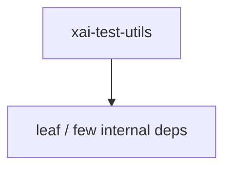

# xai-test-utils — Workspace crate

## What it is

`xai-test-utils` is a Cargo workspace member at `crates/common/xai-test-utils` (6 `.rs` files).

Shared test utilities for xAI crates.  Provides common helpers that are needed by many crates' test suites:  - **Hermetic git**: `git::ensure_hermetic_git_on_path` prepends the Bazel-provided static `git` binary to `PATH` so that tests don't depend on a system-installed git. The `require_git!` macro is a convenient shorthand.  - **Git repo helpers**: `git::init_git_repo` and [`git::git_commi

**Role:** Workspace crate. [Graph: approximate via crate tree; Human:Synthesis from lib.rs docs]

## How it works

Primary surface is `src/lib.rs`.

Notable workspace dependencies (from crate Cargo.toml, truncated): `runfiles`, `tracing`, `tracing-subscriber`.

## Used by

- Parent cluster: [common](common.md)
- Other crates that depend on this package (see Cargo graph / `cargo tree -p xai-test-utils`)

## Blast radius

Changes affect any consumer of `xai-test-utils` in the workspace. Run `cargo test -p xai-test-utils` and re-check dependent top crates (`xai-grok-shell`, `xai-grok-pager`, `xai-grok-tools`) when public APIs move.

## See also

- [systems/common.md](common.md)
- [entrypoint](../entrypoints/main.md)
- Workspace root `Cargo.toml` (generated — do not hand-edit)

## Notes

- Prefer `cargo check -p xai-test-utils` / `cargo test -p xai-test-utils` for this crate.
- Full workspace builds are slow; target the crate under change.
- See root README for build prerequisites (Rust toolchain, protoc).
