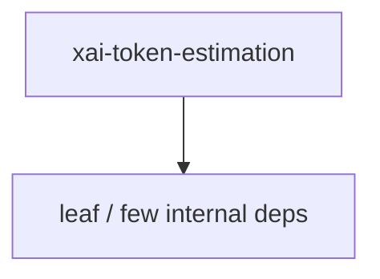

# xai-token-estimation — Workspace crate

## What it is

`xai-token-estimation` is a Cargo workspace member at `crates/codegen/xai-token-estimation` (1 `.rs` files).

Pure shared token-estimation primitives.  This crate is the single source of truth for the bytes/4 heuristic and the derived-display arithmetic that `/context`, `/session-info`, the auto-compact gates, the preflight overflow check, and every client renderer use to talk about context-window usage.

**Role:** Workspace crate. [Graph: approximate via crate tree; Human:Synthesis from lib.rs docs]

## How it works

Primary surface is `src/lib.rs`.

Notable workspace dependencies (from crate Cargo.toml, truncated): (few/none listed).

## Used by

- Parent cluster: [codegen](codegen.md)
- Other crates that depend on this package (see Cargo graph / `cargo tree -p xai-token-estimation`)

## Blast radius

Changes affect any consumer of `xai-token-estimation` in the workspace. Run `cargo test -p xai-token-estimation` and re-check dependent top crates (`xai-grok-shell`, `xai-grok-pager`, `xai-grok-tools`) when public APIs move.

## See also

- [systems/codegen.md](codegen.md)
- [entrypoint](../entrypoints/main.md)
- Workspace root `Cargo.toml` (generated — do not hand-edit)

## Notes

- Prefer `cargo check -p xai-token-estimation` / `cargo test -p xai-token-estimation` for this crate.
- Full workspace builds are slow; target the crate under change.
- See root README for build prerequisites (Rust toolchain, protoc).
