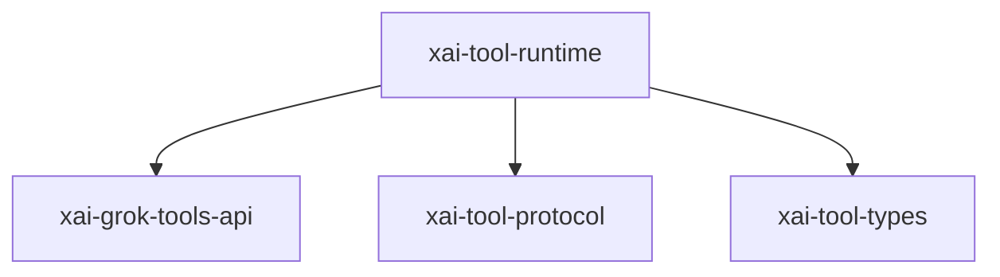

# xai-tool-runtime — Tool runtime dispatch

## What it is

`xai-tool-runtime` is a Cargo workspace member at `crates/common/xai-tool-runtime` (18 `.rs` files).

xAI Computer Hub — unified runtime contract.  Single home for the `Tool` trait, `ToolDispatch`, `ToolError`, `ToolNotification`, `ToolSearchIndex`, `ToolCallContext`, `ToolStream`, and the helper constructors that build well-formed streams. Adapters for individual tool sources re-export from here so every tool author sees the same surface.

**Role:** Tool runtime dispatch. [Graph: approximate via crate tree; Human:Synthesis from lib.rs docs]

## How it works

Primary surface is `src/lib.rs`.

Notable workspace dependencies (from crate Cargo.toml, truncated): `anyhow`, `async-trait`, `futures`, `schemars`, `serde`, `serde_json`, `tokio-util`, `xai-grok-tools-api`.

## Used by

- Parent cluster: [common](common.md)
- Other crates that depend on this package (see Cargo graph / `cargo tree -p xai-tool-runtime`)

## Blast radius

Changes affect any consumer of `xai-tool-runtime` in the workspace. Run `cargo test -p xai-tool-runtime` and re-check dependent top crates (`xai-grok-shell`, `xai-grok-pager`, `xai-grok-tools`) when public APIs move.

## See also

- [systems/common.md](common.md)
- [entrypoint](../entrypoints/main.md)
- Workspace root `Cargo.toml` (generated — do not hand-edit)
