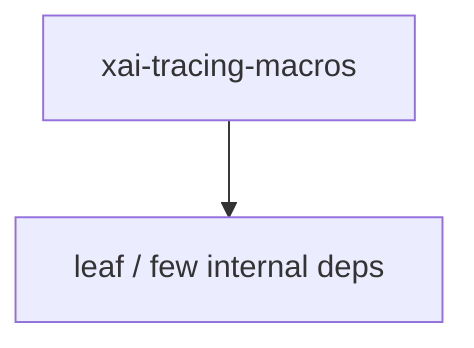

# xai-tracing-macros — Workspace crate

## What it is

`xai-tracing-macros` is a Cargo workspace member at `crates/codegen/xai-tracing-macros` (3 `.rs` files).

Tracing-based utility macros.  This crate provides macros for: - Timestamped logging (`tprintln!`, `teprintln!`) - Execution timing with automatic logging (`timed!`)  # Examples  ```ignore use xai_tracing_macros::{tprintln, teprintln, timed};  // Timestamped logging tprintln!("Hello, world!"); teprintln!("Warning: something happened");  // Execution timing let result = timed!(log: "expensive_opera

**Role:** Workspace crate. [Graph: approximate via crate tree; Human:Synthesis from lib.rs docs]

## How it works

Primary surface is `src/lib.rs`.

Notable workspace dependencies (from crate Cargo.toml, truncated): (few/none listed).



## Used by

- Parent cluster: [codegen](codegen.md)
- Other crates that depend on this package (see Cargo graph / `cargo tree -p xai-tracing-macros`)

## Blast radius

Changes affect any consumer of `xai-tracing-macros` in the workspace. Run `cargo test -p xai-tracing-macros` and re-check dependent top crates (`xai-grok-shell`, `xai-grok-pager`, `xai-grok-tools`) when public APIs move.

## See also

- [systems/codegen.md](codegen.md)
- [entrypoint](../entrypoints/main.md)
- Workspace root `Cargo.toml` (generated — do not hand-edit)

## Notes

- Prefer `cargo check -p xai-tracing-macros` / `cargo test -p xai-tracing-macros` for this crate.
- Full workspace builds are slow; target the crate under change.
- See root README for build prerequisites (Rust toolchain, protoc).
