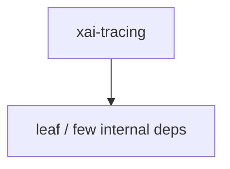

# xai-tracing — Workspace crate

## What it is

`xai-tracing` is a Cargo workspace member at `crates/common/xai-tracing` (8 `.rs` files).

Rust crate `xai-tracing` at `crates/common/xai-tracing`.

**Role:** Workspace crate. [Graph: approximate via crate tree; Human:Synthesis from lib.rs docs]

## How it works

Primary surface is `src/lib.rs`.

Notable workspace dependencies (from crate Cargo.toml, truncated): `async-trait`, `http`, `log`, `fastrace`, `fastrace-tonic`, `fastrace-opentelemetry`, `fastrace-reqwest`, `opentelemetry`.

## Used by

- Parent cluster: [common](common.md)
- Other crates that depend on this package (see Cargo graph / `cargo tree -p xai-tracing`)

## Blast radius

Changes affect any consumer of `xai-tracing` in the workspace. Run `cargo test -p xai-tracing` and re-check dependent top crates (`xai-grok-shell`, `xai-grok-pager`, `xai-grok-tools`) when public APIs move.

## See also

- [systems/common.md](common.md)
- [entrypoint](../entrypoints/main.md)
- Workspace root `Cargo.toml` (generated — do not hand-edit)

## Notes

- Prefer `cargo check -p xai-tracing` / `cargo test -p xai-tracing` for this crate.
- Full workspace builds are slow; target the crate under change.
- See root README for build prerequisites (Rust toolchain, protoc).
